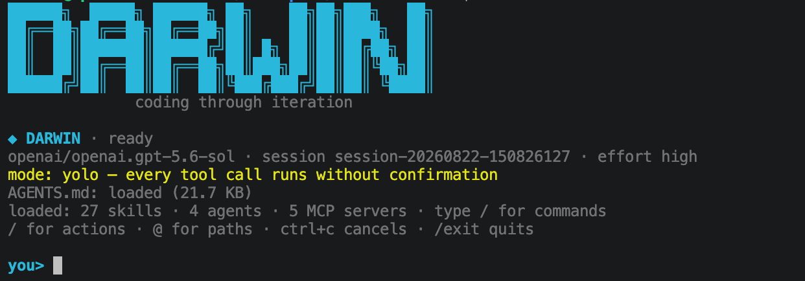

<div align="center">
  <h1>darwin</h1>
  <p>一款在终端中运行的编程代理：每次通过验收的版本，都会成为开发下一版的工具。</p>
  <p><a href="README.md">English</a> · <strong>简体中文</strong></p>
  <p>
    <a href="https://nodejs.org/">=20.3.0" src="https://img.shields.io/badge/Node.js-%3E%3D20.3.0-339933?logo=nodedotjs&amp;logoColor=white"></a>
    <a href="https://www.typescriptlang.org/"></a>
    <a href="https://www.npmjs.com/package/@strands-agents/sdk"></a>
    <a href="https://spdx.org/licenses/ISC.html"></a>
  </p>
  
</div>

## 以迭代推动演进

darwin 是一项自托管 AI 开发实验。[v0.0.1 基线版本](https://github.com/xiehust/strands-darwin/releases/tag/v0.0.1)完全由 [Claude Code](https://claude.com/claude-code) 编写。此后的功能、修复和版本发布，都由当前版本的 darwin 在本仓库内完成。新版本通过独立验收后，就会接手下一轮开发。

开发责任始终由人承担：产品取舍、安全边界和工作授权由人决定；仓库证据无法回答的问题也由人处理；最终结果仍需人来验收。darwin 在这些边界内负责编写实现。基线版本提供固定参照，后续工作则由 [`.trellis/`](.trellis/) 下的任务记录和[迭代日志](docs/iteration-log.md)留痕。

### 内置自演进研究

`/self-evolution-research` 负责在实现之前选择方向。它会先推进持久化[研究待办](docs/research/backlog_index.md)中的未完成事项；没有积压任务时，才会进行一次有记录、不可随意重抽的加权抽签。候选路径包括同类产品研究、TUI 自检、开放式改进、尚未使用的 Strands SDK 能力，以及可观测性。

研究过程会引用仓库证据或产品一手资料，剔除重复项，再按价值、架构契合度、证据强度、难度和风险评分。只有达到门槛的方向才会进入实现队列。每个方向都会单独交给内置 `developer` 监督器：新的无头 darwin 子会话完成开发，Host 随后独立检查 diff，并重新执行验收命令。只有通过验收的版本，才会进入下一个方向。

```text
未完成待办，或一次加权研究路径抽签
  → 有证据支撑的研究与评分
  → developer 监督下的实现
  → 独立验收与提交
  → 同步 README / 用户指南 / 架构文档
  → 通过验收的新版本继续研究并开发下一版
```

这套流程有明确边界，不代表 darwin 拥有产品决策权。工作树不干净、起点无法验证、验收反复失败、前提被证伪，或遇到只能由人决定的产品/安全问题时，整批工作会停止，并把原因写入记录。证据可查阅[按日期归档的研究报告](docs/research/)和[自省报告](docs/reflections/)。

## 主要能力

- **清晰的 Ink TUI：**流式 Markdown 回复、文件修改 diff、耗时与 token 消耗、斜杠命令与路径补全、提示词回看和排队、本地 `!` 命令，以及有长度上限的状态报告。
- **安全审批模式：**`default`、带分类器的 `auto`、只读 `plan` 和显式开启的 `yolo`；项目级放行规则尽量收窄，并可在会话内撤销。
- **可持续的工作状态：**按项目保存的可恢复会话、只追加轨迹、回放/搜索/分叉/导出、费用记录、可选诊断日志、后台任务，以及由父 agent 按需管理、带精确证据并在回合持久化后提交的项目记忆。
- **扩展机制：**内置及项目/全局 skills、自定义命令、子代理与 workflow DAG 委派、工具 hooks、stdio/HTTP MCP 服务器，并兼容 `.agents/` 目录。
- **自动化接口：**单次文本输出或带版本的 JSON/JSONL；严格选择会话；可限制模型调用次数和上下文卸载；取消或失败时返回非零状态码。
- **多模型支持：**Amazon Bedrock、Anthropic 直连、OpenAI 直连，以及通过 Bedrock Mantle 使用 OpenAI 兼容模型；会话中可切换模型和思考强度。

darwin 不会另写一套代理循环。它沿用 Strands SDK 的循环，只负责组装 SDK 模型、interventions、plugins、conversation manager 和工具。维护者可在[架构决策](docs/architecture/load-bearing-decisions.md)中查看设计依据。

## 安装与启动

需要 Node.js 20.3+、pnpm，以及所选模型供应商的凭证（默认使用 AWS）。

```bash
git clone https://github.com/xiehust/strands-darwin.git
cd strands-darwin
pnpm install
pnpm build
pnpm add --global .
```

构建产物会写入 `dist/`；全局安装会根据 `package.json` 注册 `darwin` 命令。请确保 pnpm 的全局可执行文件目录已加入 `PATH`；如果 pnpm 提示尚未配置，请运行 `pnpm setup`。全局安装会链接到当前源码目录，因此安装后请保留克隆下来的目录。

此后可以在任意目标仓库中直接运行 darwin；当前工作目录会被视为项目根目录：

```bash
cd /path/to/your-project
darwin
darwin --resume
darwin --resume <id>        # 查看 id：darwin sessions
darwin --session <id>
darwin doctor               # 离线只读诊断：配置、MCP、技能、hook；发现问题时退出码 1
darwin --help               # 用法语法；darwin --version 打印版本
```

开发 darwin 本身时，仍可使用 `pnpm start` 直接运行 TypeScript 源码，无需全局安装。

TUI 测试使用的 `node-pty` 是原生开发依赖，已列入 `pnpm-workspace.yaml` 的构建白名单。若添加新的原生依赖，也要更新这份白名单。

## 配置模型

模型和供应商只读取 `~/.darwin/config.json`。文件不存在时，darwin 使用内置 Bedrock 模型目录。最小 Bedrock 配置如下：

```json
{
  "provider": "bedrock",
  "model": "global.anthropic.claude-opus-5",
  "region": "us-west-2",
  "permissionMode": "default"
}
```

Bedrock 使用标准 AWS 凭证链。模型 ID 必须是 `us.`、`eu.`、`apac.` 或 `global.` 等推理配置文件 ID，不能直接填写 `anthropic.*`。直连供应商默认读取 `ANTHROPIC_API_KEY` 或 `OPENAI_API_KEY`；直连 Anthropic 还支持通过 `baseUrl`（或 `ANTHROPIC_BASE_URL`）接入任何兼容 Messages API 的端点。

多模型切换、各供应商字段、Bedrock Mantle、缓存、思考强度、上下文限制和全部会话设置，见[入门与模型供应商](docs/user-guide/getting-started.zh-CN.md)和[配置与上下文](docs/user-guide/configuration.zh-CN.md)。

## 日常使用

```text
/                       列出命令、skills 和自定义命令
@src/                   补全工作区路径（只插入路径文本）
!pnpm test              运行由用户主动输入并授权的本地命令
/developer <requirement>
/self-evolution-research
/help                   查看本地命令、输入语法和按键说明
/copy                   把最近一条已完成回答复制到剪贴板（OSC 52，SSH 下可用）
/rewind                 从已完成提示词分支对话（工作区不变）
```

按 `Ctrl+R` 可搜索当前项目的提示历史（输入文字筛选，按 `Ctrl+R`/`Up`/`Down` 切换结果，按 `Enter`/`Tab` 接受，按 `Escape` 取消）；忙碌时按 `Ctrl+C` 取消，按 `Ctrl+B` 展开或收起工具详情，使用 `/exit` 或 `Ctrl+D` 退出。编辑输入时，`Alt/Ctrl+Left/Right` 或 `Alt+B`/`Alt+F` 按词移动光标，`Alt+Backspace`/`Alt+D` 删除光标前／后的一个词，`Ctrl+_`（或 `Ctrl+-`）可撤销最近一次 `Ctrl+K`/`Ctrl+U`、`Ctrl+W` 或 `Alt` 系列的删词操作。输入框为空且空闲时，连按两次 `Esc`（第二次在 500 ms 内）会打开 `/rewind` 选择器，效果与输入 `/rewind` 完全相同；此时单按一次 `Esc` 不做任何事。模型发起的工具调用仍会经过当前审批模式；`!` 命令由你亲自输入，因此不走模型工具审批。

无交互运行方式如下：

```bash
darwin -p "inspect this project"                         # 回复写 stdout，进度写 stderr
darwin -p "inspect this project" --output-format json
darwin -p "inspect this project" --output-format stream-json
```

TUI、无头模式、结构化输出、消息队列、shell 命令和后台任务的完整约定，见[使用 darwin](docs/user-guide/using-darwin.zh-CN.md)。

## 文档

- **[用户指南](docs/user-guide/README.zh-CN.md)：**安装、供应商、日常操作、配置、状态、安全、扩展、命令参考、限制和开发说明。
- **[架构](docs/architecture/load-bearing-decisions.md)：**实现变更必须遵守的关键约定。
- **[研究待办](docs/research/backlog_index.md)与[研究报告](docs/research/)：**自演进方向的证据与排序。
- **[迭代日志](docs/iteration-log.md)：**受监督的实现批次与独立验收结果。
- **[自省报告](docs/reflections/)：**基于轨迹复盘会话，并可将改进方向写入研究待办。

## 项目状态

darwin 仍处于实验阶段，命令会直接在本机执行，并不提供沙箱。模型工具调用的安全边界是权限门。用于敏感或无人值守的任务前，请先阅读[限制与开发](docs/user-guide/development.zh-CN.md)。

## 许可证

[ISC](https://spdx.org/licenses/ISC.html)
