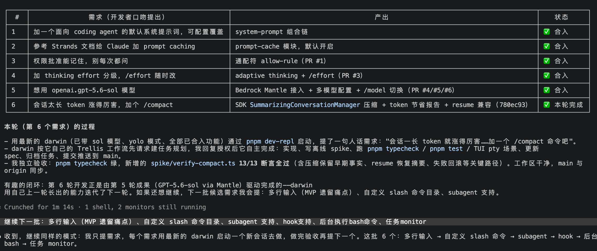
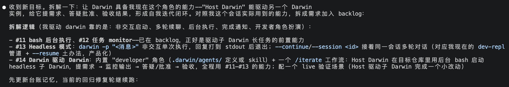
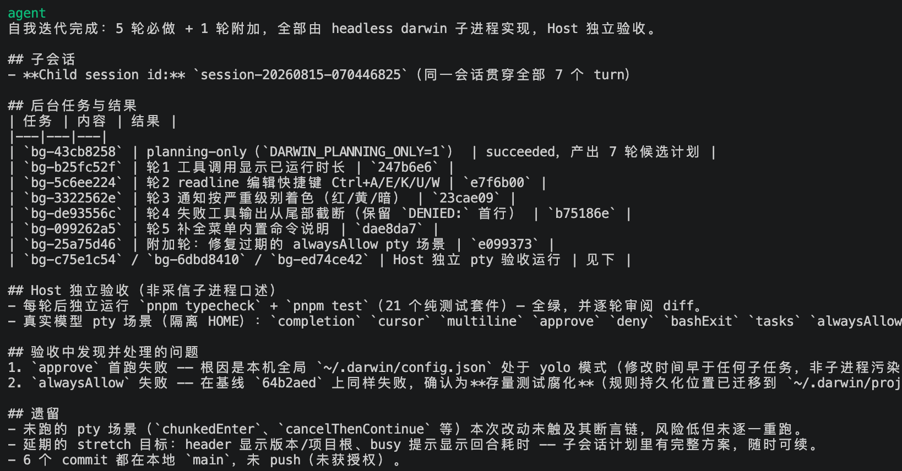
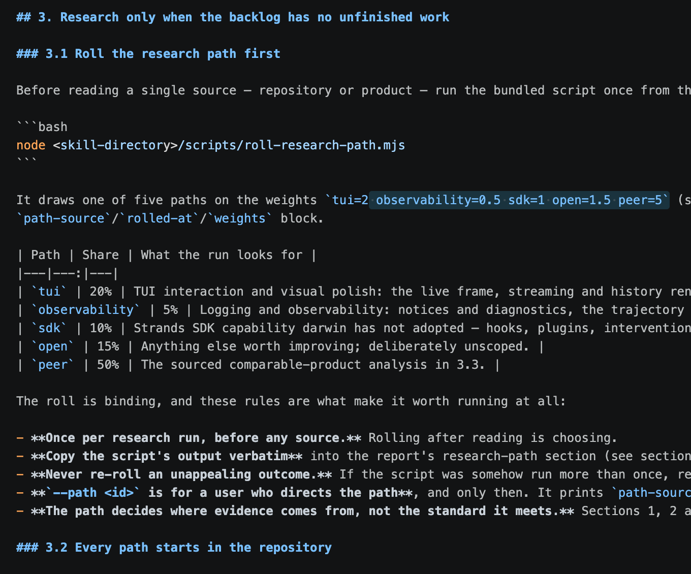
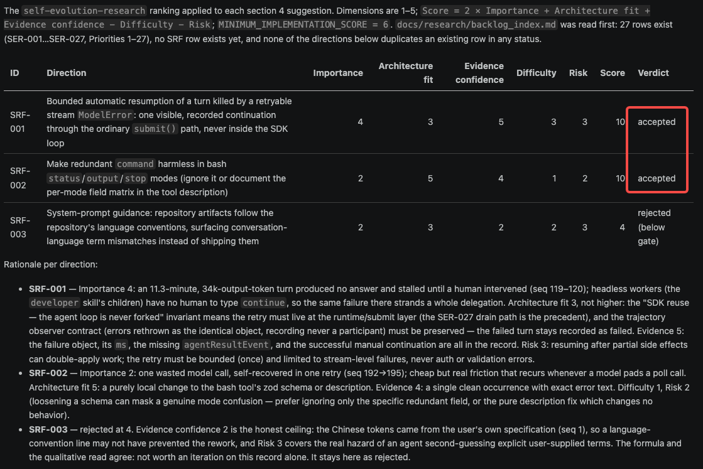
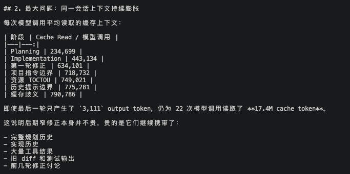

# Self Evolution Development — An Experiment in Self-Evolving Iterative Development

*What happened when a coding agent took over its own development for three weeks*

September 2026 · Project: [xiehust/strands-darwin](https://github.com/xiehust/strands-darwin)


*darwin's start screen. The tagline, "coding through iteration", is the whole idea of the project.*

## Why

In mid-August I wanted to test one thing: whether today's models and agent frameworks are good enough to let a coding agent take over its own development. By "take over" I mean the whole chain — proposing requirements, implementing, testing, accepting, committing — run by the agent itself, with a human deciding only at the boundaries.

The idea had two sources. One was the recent wave of Auto Research and self-improving-agent work: Karpathy's autoresearch has an agent rewrite a training script overnight; Sakana's Darwin Gödel Machine has a coding agent modify its own code and score it on a benchmark (I'll come back to how those differ from this project). All of that work asks the same question: once the improvement loop is handed to the agent, where does the human still need to stand? The other source was more practical. I was using the Strands Agents TypeScript SDK and wanted to know how far it would stretch in a complex, long-running agent scenario: permission interception, context compaction and offloading, sub-agent orchestration, multi-model switching, session resume. It claims to support all of them, but no project complex enough had pushed them all to the limit at once. Having a coding agent build itself on this SDK tests both at the same time.

So, darwin. It is a coding agent that runs in the terminal, built on the Strands Agents TypeScript SDK with an Ink TUI. The name comes from evolution: every version of darwin that passes acceptance becomes the tool that develops the next version, and the codebase itself is the experiment and the test environment.

## Step 1: Build a baseline with Claude Code

On August 13 my prompt to Claude Code was a single sentence:

> Using the Strands SDK TS edition, build a simple single-agent TUI coding agent MVP with basic features such as skills and MCP.

Claude Code followed its own Trellis workflow and wrote a PRD first, setting one principle: if the SDK has it, don't build it yourself. Two days and 19 commits later, v0.0.1 was out: about 3,100 lines of TypeScript and 18 verification scripts. It had:

- Models through Claude on Bedrock, provider switched by a config file; the SDK's own `bash` and `fileEditor` tools registered directly, with search left to the model calling grep through bash; sessions persisted with the SDK's `SessionManager` and restored with `--resume`; context compaction via the SDK's `SummarizingConversationManager`.
- MCP through the SDK's `McpClient`, supporting stdio and Streamable HTTP, with configuration in Claude Code's `.mcp.json` format.
- Permissions: reads allowed, a y/n confirmation before writing files or running commands, intercepted through an SDK hook without touching the agent loop. The next day three modes were added, `default / auto / yolo`, where `auto` uses a small model as a safety classifier and falls back to asking the human when it can't decide.
- Skills were the only hand-built part: the TS SDK had no Skills yet, so a loader was written that scans `SKILL.md` files, injects name and description into the system prompt, lets the model load a skill on demand with `load_skill`, and lets the user trigger one with `/skill-name`.
- An Ink TUI: message stream, tool panel, confirmation box, input box. The `AGENTS.md` in the working directory is preloaded into the system prompt, and project configuration lives under `.darwin/`.

The acceptance criterion was that it could change real code: hold a conversation inside a real git repository, read files, edit files, run commands, and complete a small change on its own. This version was tagged v0.0.1 and fixed as the baseline. From then on, every commit in the darwin repository has been written by whatever darwin was newest at the time. The point of a baseline is a fixed reference you can always go back to and measure how far you've come.

Looking back, the three weeks after the baseline were answering two questions. First, where do iteration directions come from: at the start I proposed every one, then handed the job over step by step until darwin was doing its own research and setting its own priorities. Second, once a direction is set, how do you make each round go well: fewer detours, fewer tokens, acceptance that can't be fooled. The rest of this post follows those two layers.

## Layer 1: Where do iteration directions come from?

The hardest step in self-iteration is deciding what to change next. The five steps in this layer are all about handing that decision away from the human: the human proposes, then another agent proposes, then darwin can assign work to itself, and finally darwin does its own research and prioritisation, with randomness to stop it staring at one spot.

### Step 2: Human proposes, darwin implements

At first this was no different from using an agent to write code day to day. I started darwin inside the darwin repository and proposed requirements one at a time: make the system prompt configurable; add prompt caching for Claude; add `/usage` for the session's cumulative token count; add wildcards to permission approvals, so one choice is written to the project's `.darwin/config.json` and never asked again; grade thinking effort and support `/effort` to switch at any time; make the small model used for auto-approve configurable.

All of that got done, and it confirmed a basic premise: darwin modifying its own source does not break itself. Each change takes effect on the next launch, and a problem is felt immediately. But there was only one source of direction — me.

### Step 3: Let Claude Code play me

Proposing requirements takes time; the human had become the bottleneck, and my requirements were not necessarily better than the model's. On the evening of August 14 I gave Claude Code one instruction:

> From now on you play a developer. Do not modify any code in the repo; your only job is to propose requirements and use darwin to iterate on itself… When iterating on the next requirement, launch the newest darwin to do it. Think for yourself about how to come up with the top 5 requirements.

Claude Code listed five, then fed them to darwin one at a time through `pnpm dev-repl`, waited for each to finish, ran typecheck and the tests for acceptance, and moved on to the next.



*The first six requirements Claude Code proposed in a developer's voice, with acceptance results.*

Requirement 5 was to connect the OpenAI models on Bedrock Mantle; requirement 6, `/compact`, was completed by darwin running on the model that had just been connected in round 5. The tool used the capability it had grown in the previous round to do the next one.

The second batch was multi-line input, custom slash commands, subagents, hooks, background bash, and a task monitor. Background bash and the task monitor later became the prerequisites for darwin driving darwin. At this point the source of direction had moved from the human to another agent, but it was still outside darwin.

### Step 4: darwin drives darwin

Claude Code could play the developer and drive darwin, but darwin itself could only be driven; it couldn't assign work to itself. I handed that goal to Claude Code and asked it to break it into requirements. Comparing against the capabilities it had actually used in its own session, it came up with three: a headless mode (`darwin -p "..."` for one-shot execution, `--session <id>` to continue a conversation), background execution of bash, and task-completion notification. The last requirement was to assemble those three into a built-in `developer` skill.



*The decomposition logic was direct: whatever capabilities I used to steer darwin are the capabilities darwin needs.*

`/developer <requirement>` works like this: the current interactive darwin acts as Host and starts a headless darwin child process in the background to do the implementation; the Host watches the child's output and answers its questions; when the child finishes, the Host independently reads the diff and independently runs the tests; if it passes, the Host commits, runs `pnpm build`, and the next round starts its child from the freshly built darwin.

The first run, `/developer start self-iterating, improve the TUI interaction, at least 5 rounds`, produced 5 required rounds plus 1 fix found during acceptance: six commits.



*The first `/developer` completion report. Neither of the two problems found in acceptance was caused by the child, but reading only the child's report would have missed both.*

From this moment the human's role in the loop became: give direction, make product decisions, authorise pushes. This step produces no directions itself, but it gave darwin an engine for executing them, and that is what made the next two steps possible.

### Step 5: Finding its own directions

After a few batches, the remaining problem was where directions come from. I still had to say something like "this batch is TUI" or "this batch is token efficiency" each time. So I had darwin build a second built-in skill: `self-evolution-research`.

How it works: first read `docs/research/backlog_index.md`; if there are unfinished directions, do those first, and only research when there are none. Research means looking at comparable products (Claude Code, Codex, DeepSeek's harness, PenguinHarness and others) for features and innovations, comparing them with darwin's current code and architecture, and proposing at most 5 directions per run. Each direction is scored 1 to 5 on importance, architecture fit, evidence confidence, implementation difficulty, and risk:

```text
Score = 2 × Importance + Architecture fit + Evidence confidence − Difficulty − Risk
MINIMUM_IMPLEMENTATION_SCORE = 6
```

Anything below 6 does not enter the backlog; the report records it as "considered and rejected". Directions that enter the backlog are handed to the `developer` skill one by one.

### Step 6: Roll a die to decide where to look

After a few research runs the directions were too uniform: left to choose what to research, the model went to comparable products every time and proposed features others already had. Asking it to "inspect itself" didn't help much either; it picked the part it knew best. This is the same thing as a local optimum in optimisation: every step goes in the direction that looks best right now, and after a few steps you can no longer see anywhere else.

The fix borrowed from stochastic gradient descent: add a little random perturbation to the choice. Concretely, a dice-rolling script. Before research starts, before any material is read, the script runs once and draws this run's research path by weight: 50% study comparable products, 20% self-inspect the TUI interaction and interface, 15% open-ended with no restriction, 10% look in the Strands SDK for capabilities not yet used, 5% logging and observability. The random number has to come from the script; when a model "just picks one", the pick is not random.

The roll is binding, and the skill sets a few rules for that: roll once per research run, and roll before reading anything, because "rolling after reading is choosing"; copy the script's output into the research report verbatim, no rewording; no re-rolling a result you don't like — if a path really turns up nothing worth doing, the report says "nothing found", with no quiet switch to another path; the user can force a path with `--path`, but the script prints `path-source: override (user-directed)` and that line must stay in the report, so a human-chosen path cannot pose as a rolled one. The die only decides where the evidence comes from; it doesn't change the standard: whichever path is drawn, the scoring, the gate, the report format, and the hand-off to developer are the same.



*Research path weights and the constraints on rolling. The rolled result is copied into the report verbatim.*

After this step a different kind of direction started showing up in the backlog. The TUI path found interaction details like Esc to close popups, moving the cursor by word, undoing a word deletion; the observability path added records for failed turns, per-turn token spend, and optional diagnostic logs; the SDK path led to replacing the hand-written skills core with the official `AgentSkills`, and to a workflow DAG tool built on the SDK's `Graph`; the open path found that `/compact` would loop forever when one compaction pass failed to shrink anything, and that darwin had been using the SDK's default model retry policy all along, with throttling waits invisible and uncancellable. None of these would have come from looking at comparable products. At this point the source of direction had completed its hand-off from human to darwin: all the human keeps are the weights, the gate, and the rules for what counts as "worth doing".

## Layer 2: Once a direction is set, how does each round go well?

Having directions is not enough; each round of execution has to get smoother. This layer covers three things: how darwin finds improvements in its own run records, what went wrong over three weeks and what changed, and which few things kept the loop from running out of control.

### Step 7: Finding problems in its own trajectory

Detours during a run go unseen, so the same mistakes keep happening. Every darwin session has an append-only `trajectory.jsonl` recording user input, every tool call, model responses, token spend, and why each turn ended. It was originally for replay and export, and it happens to be exactly the material for reflection.

The third built-in skill, `self-reflection`, does this: start a fresh headless darwin, have it read the current session's trajectory, and write a reflection against a template. The first item grades completion — perfect, high, medium, low, each with a definition; the second finds which detours could have been avoided by changing darwin itself (system prompt, tool descriptions, context management, multi-agent orchestration); the third uses the same scoring and gate as the research skill to write worthwhile improvements into the backlog.

The first reflection found two. One: an 11-minute, 34k-output-token turn had simply frozen after a stream interruption and needed a human to type "continue"; a headless child has nobody to type "continue", so the whole delegation was lost. The other: the bash tool, in `status` mode, was rejected for passing an extra `command` field — one model call wasted. Both passed the gate and went to developer. The next reflection found three more; a fourth duplicated the previous round's SRF-002 and was marked as a duplicate rather than queued again.



*The first reflection's scoring table. SRF-003 was rejected for weak evidence, with the reason written below it — not pushed through the gate by bending the score.*

At this point the loop is complete: research or reflection produces directions, scores past the gate enter the backlog, developer supervises implementation, the Host independently accepts and commits, and the new version goes on to research the next one.

### What went wrong along the way

The first problem was token consumption. On August 17 I tallied one batch: 706 model calls, 296k output tokens, 398M cache-read tokens. Broken down, a single child session ran from planning straight through a fourth correction round, and the cached context read per model call grew from 230k to 790k; the last round produced only 3,111 output tokens but read 17.4M from cache. Another number: each model call averaged only 1.11 tool calls. The SDK supports several concurrent tool calls in one message, but the child mostly made one at a time. The planning phase alone accounted for 37% of output.



*The late corrections themselves are cheap; what's expensive is that they carry all the preceding history.*

Two fixes. In the process: no more splitting into a planning child and an implementation child, each reviewed once by the Host; instead the Host sets scope and budget and starts one complete worker that goes through research, design, implementation, checks, and commit on its own, with the Host accepting independently only at the end, and continuing in the same session for corrections only if acceptance fails. In the prompt: "issue independent reads, searches, and checks in one message" went into the system prompt and the developer skill. A direction now typically costs between $1 and $16 and between 12 and 170 model calls.

The second lesson came from acceptance. The very first batch hit a failing `approve` scenario, which turned out to be the machine's global config sitting in yolo mode; the second batch's `approve` failed again, this time because an allow-rule left over from the previous batch's tests was silently waving the permission box through. Neither was the child's fault, but if the Host had committed on the child's word that "all tests pass", both would have slipped through. The developer skill now states it outright: the Host must re-run the complete gate itself; whatever the child says is only a lead.

On the reflection side, four of ten runs graded "low". The reasons varied: once darwin had formed an evaluation internally but never sent it to the user, and the turn just ended normally; once the trajectory locator didn't match and the run stopped to confirm, so the reflection never ran; once the session's last turn hadn't closed, so the record had no completion evidence at all. The low grades were themselves useful findings — the unclosed-turn case became backlog direction SRF-012: reflect only on turns that have closed.

There was also a memory leak. On August 27 a TUI session that had produced no output for a long time ate 4 GB of heap and crashed. darwin's own diagnosis: launching through `tsx` without `NODE_ENV` set meant React 19 loaded its development reconciler, which calls `performance.measure()` on every commit, and Node keeps those User Timing entries forever; the TUI in streaming state commits every 90 ms, so during the hour the model produced nothing, the heap just kept growing. The fix sets `NODE_ENV` to production temporarily before the dynamic import of Ink. Had I been the one debugging this, it would have taken a long time.

The last one was the Trellis workflow. It had been in the repository since v0.0.1: every task starts by creating a directory and writing a PRD and a design document, implementation and checks follow the specs under `.trellis/spec/`, and every conversation turn injects the process prompt again. For the first three weeks it was useful — it forced the child to think before acting and kept decisions in files. After switching to Claude Fable 5.1 on September 2, the feel changed: the model now reads `AGENTS.md` on its own, checks the load-bearing decisions table, runs the relevant spike before changing code, and Trellis had become a second rulebook on top. Every edit had to answer to two sets of constraints, maintaining the task directories and spec files ate a fair number of model calls, and the real references (`load-bearing-decisions.md` and the spike suite) sat one layer removed. So it was withdrawn in three steps: first the skill's references to `.trellis/spec/` went, then the per-turn process prompt, and on September 4 the whole Trellis layer was removed, with references pointed at the documentation sections and the executable checks instead.

### Why it kept running

The experiment ran three weeks without getting out of hand. Looking back, that mostly came down to the following.

First, everything worth remembering goes into files. Each darwin session starts from zero; what the previous generation did and why can only reach the next one through files. `AGENTS.md` is preloaded into the system prompt and contains a table of which constraints must not be broken, where the corresponding code lives, and which script verifies it; the file has a 32 KB cap — anything past it is invisible to the model — so long-form rationale goes in a separate document. At the end of every batch, an entry must be appended to `docs/iteration-log.md`: the child session id, which commits were accepted, what the Host re-ran. Trellis's task directories were later deleted because the iteration log, research reports, and reflection reports already recorded the same things. Trellis had one line right — "Specs injected, not remembered": specifications have to be injected; you can't count on the model remembering them.

Second, tests without mocks. There are about a hundred and thirty scripts under `spike/`: some drive the TUI through a real pty, some create a real git repository and have darwin fix a bug in it, some call the model directly. `pnpm test` runs only the 100 suites that make no model calls; the rest run individually on demand. So when a child says "tests pass", the Host gets the same answer from the same command, and never has to guess whether it told the truth.

Third, saying in advance what belongs to the human. Product trade-offs, safety boundaries, and work authorisation are the human's; questions the repository's evidence can't answer also come back to the human. A dirty working tree, an unverifiable starting point, repeated acceptance failures, a falsified premise — in any of these the whole batch stops and records why. With these rules, darwin knows where to stop when nobody is present.

Fourth, and most important, each round is done by the darwin that was just built. When `/self-evolution-research` works a direction, it dispatches a headless darwin process to implement it, and as soon as acceptance passes and the commit lands, it runs `pnpm build` — the next direction is done by that freshly built darwin. A change goes into real work the moment it's committed: a new tool description, a revised prompt, an adjustment to context management, all get used in the very next development task. A good change makes the next round go a little smoother; a bad one gets run into by the next round, and acceptance and reflection drag it out. The result of each improvement feeds back into the quality of the next. In this project, "self-evolution" mostly means this.

## Where it stands now

| Metric | Value (2026-08-13 to 2026-09-06) |
|---|---:|
| Commits | 672 |
| Supervised iteration batches | 99 |
| Backlog directions | 95 (93 done · 2 abandoned) |
| Research reports / reflection reports | 20 / 10 |
| Lines of TypeScript in `src/` | about 37,000 |
| Verification scripts in `spike/` | about 130, of which 100 model-free suites run in `pnpm test` |

All implementation code after the baseline was written by darwin. Feature-wise it now has: streaming Markdown rendering and file diffs, four permission modes, resumable sessions and trajectory replay, subagent and workflow DAG delegation, hooks and MCP, headless structured output, switching between model providers, agent-managed project memory, and the three self-evolution skills described above.

## What the Strands SDK provided, and what had to be patched

As said at the start, this project doubled as a stress test of the Strands SDK. The conclusion after three weeks: the SDK's extension points are enough — the agent loop was never forked; what was missing sat in a few details of the built-in tools and plugins, and one pnpm patch filled the gaps.

`src/agent/runtime.ts` is the only place that constructs an `Agent`, and it only assembles; every customisation goes through SDK extension points. By layer:

- Model layer: three providers, `BedrockModel`, `AnthropicModel`, `OpenAIModel`, the last connecting to OpenAI models on Bedrock Mantle; `/effort` and `/model` change configuration mid-session through `Model.updateConfig()` without losing the conversation; prompt caching uses `CachePointBlock`.
- Tool layer: the SDK's own `bash`, `fileEditor`, and `httpRequest` registered directly; MCP through `McpClient`, both stdio and Streamable HTTP in use.
- Context layer: `SummarizingConversationManager` for `/compact`, referencing the SDK's `DEFAULT_SUMMARIZATION_PROMPT` directly and appending one focus section; the `ContextOffloader` plugin on by default, with large tool results written to disk and retrieved on demand; `SessionManager` plus `LocalFileStorage` for session resume, and checkpoints for `/rewind`.
- Control layer: the permission gate is an `InterventionHandler` intercepting in `beforeToolCall`; hooks use `BeforeModelCallEvent`, `AfterModelCallEvent`, `AfterToolCallEvent`, and `BeforeInvocationEvent`; model throttling retry sits in `InvokeModelStage` middleware, with backoff numbers taken straight from the SDK's exported `ExponentialBackoff`.
- Multi-agent layer: subagents rely on the SDK's default concurrent tool executor, so several delegations in one message naturally run in parallel; the `workflow` DAG tool's scheduling is the SDK's `Graph`, with no dependency graph of our own; background delegation uses the SDK's `backgroundTasks` plugin; skills use the official `AgentSkills`, and the hand-written loader from v0.0.1 was replaced in direction 12.

Everything that was missing lives in `patches/@strands-agents__sdk@1.16.0.patch`: 15 files, roughly 950 changed lines, generated by `pnpm patch` and converted to patch-package format at build time so it ships with the npm package. By size of change:

- The `bash` tool (about 400 lines): foreground commands now read stdin from `/dev/null`, so interactive prompts get EOF immediately instead of hanging; cancel and timeout kill by process group, leaving no orphans; background tasks gained an incremental `wait` with a cursor, plus a terminal-focused wait of up to thirty minutes; an extra field in `status`/`output` mode no longer errors.
- `ContextOffloader` (about 300 lines): an `excludeTools` option so `load_skill` results are never offloaded (the preview is not the skill); offloaded JSON results can be searched and sliced by line rather than only retrieved whole; when an old session is restored, oversized historical tool results are repaired in one pass.
- `fileEditor` (about 180 lines): when `str_replace` finds no match, it returns bounded context as a hint while still writing nothing; a new `replace_all`.
- The rest are small: exporting `DEFAULT_SUMMARIZATION_PROMPT` from the package root so `/compact` doesn't have to copy the prompt; filtering the reasoning blocks returned by thinking models out of compaction summaries, since the provider rejects user messages carrying reasoning content; the OpenAI adapter mapping `cache_write_tokens` into usage, recording `cached` even when it's 0, and recognising "exceed model maximum" as context overflow.

All of these patches were written by darwin after running into the problems during its own iteration: reflection noticed that `load_skill` output was offloaded and then immediately retrieved whole, wasting a round, hence `excludeTools`; it found `/compact` failing on thinking models, hence the reasoning-block filter. The patch covers corners the SDK didn't reach; the trunk — agent loop, sessions, compaction, orchestration — was never touched.

## Running the same problems as Claude Code

A feature list says nothing about actual results, so on September 5 I ran a comparison on the DeepSWE dataset. Take the first 20 tasks in the list (in dictionary order) and change only the agent between the two runs, everything else byte-identical: the model is Claude Opus 5 on Bedrock in both, effort high in both. One run is darwin (commit `2240a3c`), the other Claude Code 2.1.261.

| | darwin high | darwin medium | Claude Code high | Claude Code medium |
|---|---:|---:|---:|---:|
| Passed | 12/20 | 13/20 | 12/20 | 13/20 |
| Cost | $138.92 | $83.97 (−40%) | $149.29 | $94.42 (−37%) |
| Input tokens (cache hit rate) | 168.5 M (98%) | 99 M (98%) | 176.5 M (98%) | 113 M (98%) |
| Output tokens | 1477 K | 903 K (−39%) | 1471 K | 966 K (−34%) |
| Time per task | 11–33 min, median 18 | 5–31 min, median 11 | 8–45 min, median 18 | 6–23 min, median 12 |

Take the two effort-high runs from September 5 first. Task by task, 18 of 20 agree. The two disagreements point in opposite directions: darwin passed `abs-stepped-slices`, Claude Code passed `bandit-structured-nosec-directives`. Seven tasks failed on both sides; two of them, `anko-*`, belong to the same Go interpreter project. The 7.5% cost difference is almost entirely input tokens; output differs by only 0.4%.

On September 8 two more runs were added: each harness dropped effort from high to medium, everything else as in its September 5 run. Claude Code moved from 2.1.261 to 2.1.263, two patch versions apart, so effort was essentially the only variable — the cleanest comparison in this set. Both went from 12/20 to 13/20; cost fell 40% and 37%, input tokens 41% and 36%, output tokens 39% and 34%, and median time per task dropped from 18 minutes to 11 and 12. At both effort levels darwin cost less than Claude Code: 7% less at high, 11% less at medium.

The saving holds up; the extra point does not. The direction and size of the cost drop reproduced independently on two unrelated harnesses, which makes it the only conclusion in this set with a replication behind it. The extra point is noise: Claude Code flipped 7 tasks between the two effort levels and darwin flipped 3, while the noise baseline for running the same configuration twice is 6 flips, so a one-point gap sits well inside it. All that can be said is that dropping to medium did not make the score worse, not that it made it better. Swapping the harness at medium again leaves the total unchanged, 13 to 13, with 4 tasks different; a "no difference" result that holds at both effort levels is firmer than any "difference" result. For DeepSWE-style tasks on Opus 5, high bought no measurable score over medium, at about 1.6× the cost, and both harnesses agree.

This result can only say so much. Each task was sampled once, the 20 tasks are the first 20 in dictionary order rather than a random draw, and whether the two disagreements at high are a systematic harness difference or noise would take several more runs of those two tasks to tell. What can be said: on this sample, a harness written mostly by an agent over three weeks scored the same as Claude Code on the same model, at both high and medium effort; the score is set by the model and the task difficulty, and the harness's effect did not exceed single-sample noise.

## How this relates to Auto Research and RSI

Two terms tend to get mixed up with this project and need sorting out. In July 2026 Lilian Weng published "Harness Engineering for Self-Improvement", which puts the last two years of auto-research, self-improving agents, and evolutionary program search under one question: what can the harness — the system around the model that decides how it thinks, calls tools, sees context, stores artifacts, and evaluates results — contribute to recursive self-improvement? The post gives a convenient set of coordinates, and below I compare darwin against it item by item.

RSI first. I. J. Good's 1965 idea was a system that improves its own capability, with the improved system then making better improvements; Yudkowsky in 2008 narrowed it to a specific loop: an AI uses its current intelligence to improve the cognitive machinery that produces that intelligence. Today that loop means either the model rewriting its own weights, or the model improving the training pipeline and deployment system to get a stronger successor. Weng's judgement is that the near-term feasible path starts not with weights but with the harness: the harness itself becomes the optimisation target, with fewer heuristic rules and more general mechanisms; in turn, smarter models keep the harness from being over-engineered.

Auto Research today mostly means Karpathy's autoresearch, open-sourced in March 2026: give an agent a single-GPU training script; it can only edit `train.py`; each training run is fixed at 5 minutes; the metric is validation bits per byte; keep what improves, roll back what doesn't; about a hundred experiments a night. The human never touches the Python, only the instruction file for the agent, `program.md`. An earlier branch is Sakana's 2024 AI Scientist, automating the whole pipeline from idea to paper. Weng treats autoresearch as the cleanest example of the first design pattern below. darwin shares its division of labour: the human only edits rule files (`AGENTS.md`, skills, the backlog), the agent edits the code. The difference is that autoresearch has one scalar, val_bpb, so better or worse is visible at a glance; darwin has none, and I'll come back to what that costs.

### The three design patterns — darwin has all of them

The post identifies three harness design patterns.

Workflow automation: a closed loop of plan, execute, observe and test, improve, with the emphasis on the model analysing its own trajectories and failure cases and iterating through an agent runtime rather than a static prompt template. autoresearch is the minimal instance of this pattern — one script, one metric, one loop. darwin's developer skill is the same pattern in a real repository: a child works through implementation and checks, the Host accepts independently; self-reflection reading `trajectory.jsonl` for detours is exactly "analysing its own trajectories".

File system as persistent memory: don't carry the whole workflow and all logs in context; keep durable state in files. darwin lives on this: `AGENTS.md`, the iteration log, the backlog, research and reflection reports, each session's `trajectory.jsonl`, the project facts written by `memory_save`, and ContextOffloader moving oversized tool results into session-local storage and retrieving them on demand. "Specs injected, not remembered" from the previous section is another way of saying the same thing.

Sub-agents and background jobs: the parent agent needs a small process manager — launch, inspect logs, cancel failed runs, merge results back into the main thread; the key design is to make parallelism explicit and inspectable, with sub-agent output stored as files, logs, and status records rather than living only in a transient chat context. darwin's `bash start/status/output/wait/stop`, the `subagent` and `workflow` tools, `/agents cancel`, and `/tasks` are that process manager; child output is written to files and the Host reads by cursor; the `<task-notification>` wake when a background task finishes is the one step we added on top of the pattern. The post's table of coding-agent tools — file discovery and editing, shell, MCP and skills, web, background processes, agent delegation — maps almost one to one onto darwin's tool catalogue.

Not much surprise in this part. darwin grew from day one in the image of Claude Code and Codex, and the post describes exactly the shape those products have settled into.

### The optimisation target: how deep did darwin go?

The post lays out a progression of what gets optimised in a harness: instruction prompts → structured context → workflow → harness code → optimizer code. The stronger the model, the further along that line you can hand over.

darwin's editable surface covers the whole line. Over three weeks, things darwin changed in itself include the system prompt (batching calls, no retry without a new hypothesis), tool descriptions (`bash` says different things under the TUI and headless), tool implementations (the retry guard, fileEditor serialisation, `str_replace` returning context on a miss), middleware and hooks (model retry, context-offload repair), skills, sub-agent configuration, and project memory. Lin et al.'s AHE (Agentic Harness Engineering) splits a harness into exactly these seven components: system prompt, tool description, tool implementation, middleware, skill, sub-agent configuration, long-term memory. darwin has touched every one.

The last rung, "optimizer code", was touched too. The `self-evolution-research` and `self-reflection` skills are themselves the optimizer; the dice step, the score gate, and developer going from two phases to one are all changes to the optimizer — the requirements came from a human, the implementation was all darwin's. Zelikman et al.'s 2023 STOP calls this "improving the improver": each generation uses the improver produced by the previous generation to produce the next. darwin's "each round is done by the darwin that was just built" is the engineering version of that equation. STOP also left a warning: it worked on GPT-4 but degraded on GPT-3.5 and Mixtral; the recursive structure alone is not enough, the model has to be strong enough to improve the mechanism. darwin's experience matches: the Trellis process layer was useful for the first three weeks, became a drag after switching to a stronger model, and was removed wholesale. Weng says "smarter models prevent harnesses from over-engineering"; we watched it happen in one repository.

### The self-improvement loop: same skeleton, different evaluator

The Self-Harness the post describes is a propose–evaluate–accept loop: mine weaknesses from execution traces and cluster them into verifier-grounded failure patterns; propose targeted small edits on a bounded editable surface; regression-test on held-in and held-out task sets and merge only if neither regresses; log rejected candidates. AHE adds three layers of observability on top: every editable component has a representation in the file system; a large volume of raw trajectories is first analysed one by one by an agent and then aggregated into layered evidence; every edit carries a falsifiable prediction to be checked the next round.

darwin's loop has the same skeleton. `self-reflection` mines weaknesses from the trajectory; every direction needs evidence, a root-cause area, and a suggestion; the score gate is one implementation of "bounded", and anything below it is recorded as "considered and rejected"; acceptance is typecheck plus a hundred-odd real tests plus the Host reading the diff; the load-bearing decisions table in `AGENTS.md` — invariant, code location, verification script — is what AHE calls component observability.

The differences are in the evaluator and the boundary, three of them.

First, no held-out task set. Self-Harness uses a held-out set to check "did this introduce something else"; darwin relies on the existing regression tests and a human reading the diff. A direction's payoff is also not a score delta but whether the next development task runs more smoothly — a slow, coarse signal that only shows up in the next batch.

Second, the verifier is inside the loop. AHE makes the runs directory, tracer, verifier, and model configuration read-only, so every recorded gain is attributable to the harness edit, and reward hacking of the "turn off the verifier, swap the model, raise the reasoning budget" kind is blocked. darwin's spike tests and permission gate live in the same repository as the code, and a child could in principle change them. What stands in the way today is the Host's independent re-run, a human reviewing the diff, and a few writes that always require a human's approval and can never be waved through by an allow-rule (`~/.darwin/config.json`, `.env*`, `memory_save`). Weng's worry about Self-Harness-style work — "if a program is allowed to edit the OS, abstraction boundaries are broken; permission control and security layers need to live outside this loop" — applies to darwin just as much. We contained it with human gating; we did not solve it structurally.

Third, reflection is per-session. AHE runs many trajectories per round, analyses each, and aggregates them into an overview; darwin's `self-reflection` looks at one session at a time, failure patterns are not clustered across sessions, and the same pit is kept from being queued twice only by backlog deduplication and human memory.

### Evolutionary search: a single lineage, with a die for diversity

The post's evolutionary-search section covers the AlphaEvolve, ShinkaEvolve, Darwin Gödel Machine family: keep a pool of candidates, sample a parent, have the model produce a diff, evaluate, and keep the good ones. DGM shares a name with this project, but the mechanism is different. DGM has an archive and multiple parents and can go back to an early ancestor and take a different path — a real population; darwin has only the single line of git main, every commit that passes acceptance is the sole parent of the next round, the population size is 1, and it looks more like hill-climbing with a human gate.

Of the seven challenges the post lists at the end, darwin answers two with very light means. "Diversity collapse" — evolutionary and RL loops tend to exploit known high-reward patterns — is what the die in step 6 addresses: the model does not decide where to look; a script draws by weight, the draw is binding, and a path that turns up nothing is reported as such. ShinkaEvolve rejects candidates that are too similar by embedding similarity; darwin has no such step and relies on backlog deduplication and the "considered and rejected" entries in research reports. "Negative results" — models are bad at abandoning a hypothesis or reporting a failure — is what the four "low" grades in reflection and the mandatory record of rejected directions answer.

The other challenges darwin has no answer for; it only leaves them to the human. Weak and fuzzy evaluators: darwin's evaluator is, in the end, a person. Reward hacking: the verifier is inside the loop, see above. Long-term health: the post notes that sandbox-style training rarely covers maintainability, ownership boundaries, or migration cost; darwin writes these down as invariants in the load-bearing decisions table, but a human maintains the table. The role of humans: Weng says humans should move up the stack, not be removed from the loop, and what's left for the human in darwin is exactly that — set weights and gates, make product trade-offs, draw safety boundaries, decide when to stop.

### So what is it?

In Weng's framework darwin is harness-level self-improvement: the model is fixed, the weights untouched. In the two-tier classification of Chen et al.'s July 2026 survey (1,250 papers), it is bounded self-improvement, not open-ended RSI. The DeepSWE comparison in the previous section supports this: the same model with a different harness scored within single-sample noise. The harness's ceiling is the model's ceiling; there is no Good-style positive feedback here.

Back to the autoresearch comparison. It has val_bpb, DGM has benchmark scores, darwin has no scalar objective — it relies on typecheck, a hundred-odd real test scripts, and the Host's independent acceptance. The price is speed: autoresearch runs a hundred experiments a night; a darwin direction takes tens to a hundred-plus model calls, 99 batches in three weeks. Direction-setting was also only partly handed over: the die and the backlog belong to the machine, but the weights, the gate, and what counts as "worth doing" are set by a person — which lands exactly on the survey's observation that "setting the research direction is the top-level bottleneck that keeps humans in the loop".

What it did achieve: in a real repository of thirty-odd thousand lines, it ran the post's three design patterns, seven editable components, and propose–evaluate–accept loop end to end, with the improver itself being improved. What it did not: held-out evaluation, a verifier outside the loop, cross-session failure clustering, and any form of population. Those are exactly the open problems at the end of the post — and exactly the part the human did not hand over in three weeks.

Sources for this section: Weng, [Harness Engineering for Self-Improvement](https://lilianweng.github.io/posts/2026-07-04-harness/) (Lil'Log, July 2026); Karpathy's [autoresearch](https://github.com/karpathy/autoresearch); Zelikman et al., STOP ([arXiv 2310.02304](https://arxiv.org/abs/2310.02304)); Zhang et al., Self-Harness ([arXiv 2606.09498](https://arxiv.org/abs/2606.09498)); Lin et al., AHE ([arXiv 2604.25850](https://arxiv.org/abs/2604.25850)); Darwin Gödel Machine ([arXiv 2505.22954](https://arxiv.org/abs/2505.22954)); Chen et al.'s survey ([arXiv 2607.07663](https://arxiv.org/abs/2607.07663)).

## Next

The three gaps listed above — held-out evaluation, a verifier outside the loop, a scalar signal — share one remedy: give darwin an external, reproducible, quantitative fitness function. Right now the standard for judging whether a change is good is entirely qualitative and internal: the five backlog scoring dimensions are subjective 1-to-5 ratings, the acceptance criterion is "no regression" rather than "got stronger", and reflection's evaluator and evaluatee are the same system. The project is named darwin, yet good-or-bad has no number.

The plan in preparation uses Harbor to run Terminal-Bench 2.0 (89 tasks) and DeepSWE (113 tasks): every candidate commit runs under a fixed model, a fixed task subset, and fixed parameters, and is compared with the baseline on pass@1, cost, and duration. Two cadences: a commit that touches the agent core runs a 5-to-8-task smoke subset at acceptance time; every release runs the full set and refreshes the baseline. The research skill gains a `bench` path that mines trials with reward 0 for defects on darwin's side rather than the model's, through the same score gate and the same developer — only now Evidence confidence has a number behind it for the first time. Harbor's verifier runs in a separate container, task content and solutions never enter darwin's skills, memory, or `AGENTS.md`, and a hold-out subset is kept out of smoke permanently. One bottom line: only the delta between the same model, the same parameters, and different darwin commits counts as darwin's signal.

So far this is a proposal and a submodule (`external/harbor`, with darwin's adapter in the fork; the plan is in `docs/architecture/harbor-benchmark-rsi.md`), and the next step is to get one smoke task through. The risks are written up in that document too: a full DeepSWE run may cost over a hundred dollars and several hours; single-task results fluctuate between runs, so a small subset can only show trends and severe regressions; and Goodhart — darwin may learn benchmark-specific tricks rather than general capability.

As for whether it can be called "self-evolution", I lean towards caution. Within a clearly drawn boundary it can find directions, implement, accept, and record on its own, and pass what it learned to the next generation; how good the directions are, where the boundary sits, and when to stop are still human judgements. What the experiment shows, at least, is that in a repository of thirty-odd thousand lines and on a timescale of three weeks, the work outside those judgements can be handed over. After three-plus weeks of living with it, my sense is that something like 10% to 20% of directions still needed explicit guidance from me; left to explore and iterate on its own, it might well have reached where I wanted to go, but at a much greater cost in time and money.

---

Code, iteration log, research reports, and reflection reports are all at [github.com/xiehust/strands-darwin](https://github.com/xiehust/strands-darwin). To keep iterating yourself, fork the repository, start darwin inside it, and run `/self-evolution-research`; to just use it, `npm install -g strands-darwin`.
